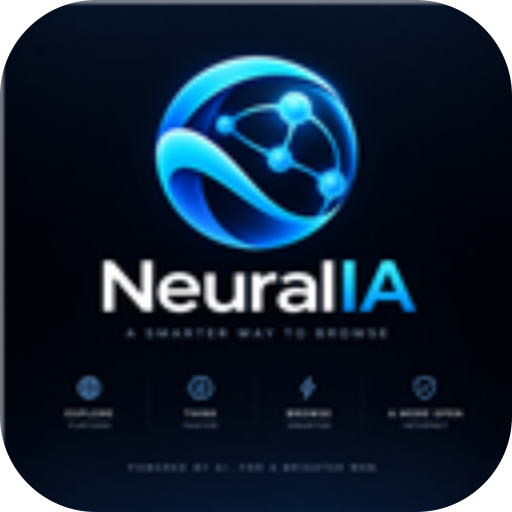

<p align="center"></p>
<h1 align="center">NeuralIA</h1>
<p align="center"><strong>The browser without the browser.</strong></p>
<p align="center">Search with AI. Read the Web. Open a full page only when you actually need it.</p>

## What NeuralIA is

NeuralIA **v1.0** is an AI-first, reader-first, system-WebView browser written in Rust.

It deliberately refuses the usual browser arms race. It does not ship Chromium, does not implement its own JavaScript engine, does not carry a local LLM, and does not try to become an operating system with tabs.

```text
native Rust home
      │
      ├── question ─────► Google AI Mode ─┐
      ├── URL ──────────► Reader ─────────┼► lazy system WebView2
      └── web:<URL> ─────► full page ─────┘
```

On Windows, **no WebView is created while the native home screen is idle**. WebView2 is instantiated only after the user asks, reads, or explicitly opens a page, and it is destroyed when the user returns home.

## Design rules

1. Native idle shell first; system WebView only on demand.
2. One system WebView maximum, never a bundled browser engine.
3. No local LLM in the default build.
4. No custom JavaScript engine.
5. No custom CSS compatibility project.
6. URLs open in Reader by default.
7. Full Web is an escape hatch, not the product center.
8. Performance budgets are architecture requirements.

## Workspace

```text
NeuralIA/
├── crates/neural-core/     # intent, URL policy, Reader, search, history
├── crates/neural-app/      # native Windows shell + lazy WebView2
├── assets/neuralia-logo.svg
├── docs/specs/
└── .github/workflows/
```

## Input grammar

| Input | Result |
|---|---|
| `como funciona Raft?` | Google AI Mode |
| `? MVCC vs OCC` | Google AI Mode |
| `https://example.com/article` | Reader |
| `reader:https://example.com` | Reader |
| `web:https://example.com` | Full WebView |
| `home:` | Native NeuralIA home |

## Build

Portable core:

```bash
cargo test -p neural-core
```

Windows desktop:

```powershell
cargo run -p neural-app --release
```

The desktop app requires the Microsoft Edge WebView2 Runtime only for AI/Reader/Web surfaces.

## Keyboard

- Enter: submit
- Backspace: edit
- Ctrl+V: paste
- Ctrl+L: clear/focus the native omnibox
- Escape: return to the native home from web content

## Status

- [x] Rust workspace
- [x] native Windows idle shell
- [x] lazy WebView2 lifecycle
- [x] intent parser
- [x] Google AI Mode routing
- [x] bounded HTTP Reader
- [x] semantic article extraction
- [x] safe Reader HTML
- [x] local append-only history
- [x] IPC isolation for external pages
- [x] stale Reader result cancellation
- [x] CI Linux + Windows
- [x] engineering specifications
- [ ] measured startup/RAM benchmark gate
- [ ] signed Windows installer
- [ ] macOS shell
- [ ] Linux shell

### v1.0 security baseline

- Reader follows redirects manually and validates every destination before the next request.
- Public pages cannot redirect Reader into obvious loopback/private/link-local targets.
- External Web pages do not receive NeuralIA IPC.
- Web permissions such as camera, microphone, geolocation and notifications are denied by default.
- Reader output is escaped and protected by a restrictive Content Security Policy.
- Local paths and non-HTTP(S) schemes are never silently converted into remote AI searches.
- History writes are locked and flushed to avoid interleaved JSONL records across instances.

See [CHANGELOG.md](CHANGELOG.md) and [the specification index](docs/specs/README.md).

## Non-goals

NeuralIA is not building V8, Blink, an extension ecosystem, or another bundled Chromium distribution. Those are excellent ways to turn a small repository into a hereditary obligation.

## License

MIT.
