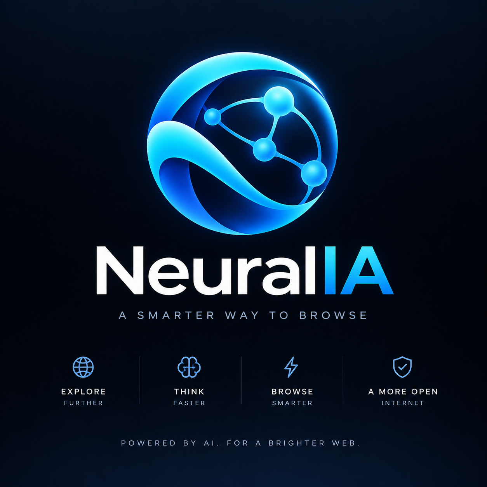

<p align="center"></p>

<h1 align="center">NeuralIA</h1>
<p align="center"><strong>The browser without the browser.</strong></p>
<p align="center">Search with AI. Read the Web. Open a full page only when you actually need it.</p>

## What NeuralIA is

NeuralIA **v1.0.1** is an AI-first, reader-first, system-WebView information client written in Rust.

It deliberately refuses the usual browser arms race. It does not ship Chromium, does not implement its own JavaScript engine, does not carry a local LLM, and does not try to become an operating system with tabs.

```text
native Rust home
      │
      ├── question ─────────► Google AI Mode ─┐
      ├── URL ──────────────► Reader ─────────┼► lazy system WebView2
      ├── web:<URL> ────────► full page ──────┘
      └── compare:<question> ► 3 provedores lado a lado (opt-in explícito)
```

Uma pergunta normal vai **só** para o Google AI Mode. O comparador envia a mesma
pergunta ao Google, ChatGPT e Claude ao mesmo tempo, e por isso nunca é
automático: exige o prefixo `compare:` ou o botão **Comparar**.

On Windows, **no WebView is created while the native home screen is idle**. The omnibox is a native Windows edit control; WebView2 is instantiated only after the user asks, reads, or explicitly opens a page, and it is destroyed when the user returns home.

## Design rules

1. Native idle shell first; system WebView only on demand.
2. One system WebView maximum, never a bundled browser engine.
3. No local LLM in the default build.
4. No custom JavaScript engine.
5. No custom CSS compatibility project.
6. URLs open in Reader by default.
7. Full Web is an escape hatch, not the product center.
8. Performance and security budgets are architecture requirements.

## Workspace

```text
NeuralIA/
├── crates/neural-core/     # intent, URL policy, Reader, search, history
├── crates/neural-app/      # native Windows shell + lazy WebView2
├── assets/neuralia-brand.jpg # official NeuralIA brand artwork
├── assets/neuralia-logo.svg  # compact in-app legacy mark
├── docs/specs/
└── .github/workflows/
```

## Input grammar

| Input | Result |
|---|---|
| `como funciona Raft?` | Google AI Mode |
| `? MVCC vs OCC` | Google AI Mode |
| `compare: MVCC vs OCC` | Comparador: envia a mesma pergunta ao Google AI Mode, ChatGPT e Claude |
| `https://example.com/paper.pdf` | Visualizador de PDF embutido (o Reader só lê HTML) |
| `https://example.com/article` | Reader |
| `reader:https://example.com` | Reader |
| `web:https://example.com` | Full WebView |
| `home:` | Native NeuralIA home |

## Build

Portable core:

```bash
cargo test --locked -p neural-core
```

Windows desktop:

```powershell
cargo run --locked -p neural-app --release
```

The desktop app requires the Microsoft Edge WebView2 Runtime only for AI/Reader/Web surfaces.

## Keyboard

The native omnibox inherits Windows text editing, selection, clipboard, IME and accessibility behavior.

Keyboard focus always lives inside a child window (the omnibox or a WebView2),
so the shortcuts below are captured *inside* every page, in the capture phase,
before the site sees the key. They work on every surface unless noted.

| Keys | Action |
|---|---|
| `Enter` | submit the omnibox |
| `Esc` | back one level: fullscreen → 3 columns → Home |
| `Backspace` · `Alt+←` · `Alt+→` | page history back / forward |
| `Ctrl+L` | return to the omnibox with its text selected |
| `Ctrl+T` · `Ctrl+W` | Home · back |
| `Ctrl+R` · `F5` | reload |
| `Ctrl` `+` / `-` / `0` | zoom, on Chrome's ladder (25%–400%), inherited by new pages |
| `Ctrl+F` | in-page find bar (Enter / Shift+Enter / Esc) |
| `Ctrl+P` | print the page you are looking at |
| `Ctrl+H` | the 20 most recent local history entries |
| `Ctrl+Shift+Delete` | clear local history (the WebView2 profile is untouched) |
| `F12` · `Ctrl+Shift+I/J/C` | Chromium DevTools |
| `Ctrl+U` | view page source |
| `F11` | fullscreen for the current comparator column |
| `F8` | auto-scroll on / off |
| `1` `2` `3` · `0` | expand a comparator column · restore three columns |

`Backspace` and the digits are ignored while typing in a field; `Ctrl` combinations are not.

## Reading

Opening a document asks once per session whether to advance the page automatically
(**Sim** / **Não**, bottom centre). With **Sim**, the page moves one screen every
30 seconds and stops at the end. A single document — HTML, plain text or PDF — is
advanced with a synthesized Page Down, which is the only route that reaches the
Edge PDF viewer; the three comparator columns are advanced by script. `F8` toggles
it at any time. EPUB is not supported: WebView2 does not open it.

## v1.0.1 hardening baseline

- Reader enforces one deadline across the complete redirect chain.
- Public Reader DNS resolution rejects loopback, private, link-local and reserved IP ranges before connecting.
- Reader uses the operating-system TLS verifier.
- Reader runs on one bounded worker; newer pending reads replace older pending reads.
- Reader HTML executes no NeuralIA JavaScript and has `script-src 'none'`.
- External Web pages receive no NeuralIA IPC.
- New-window requests are reused in the single WebView instead of multiplying WebViews.
- Local history is bounded, written off the UI thread, and can be cleared.
- Release dependencies are locked and CI uses `--locked`.
- GitHub Actions are SHA-pinned.
- Stable release assets are created once and never overwritten.
- Release creation is gated on a successful `main` CI run.

## Status

- [x] Rust workspace
- [x] native Windows idle shell
- [x] native accessible Windows omnibox
- [x] lazy one-WebView lifecycle
- [x] intent parser
- [x] Google AI Mode routing
- [x] bounded HTTP Reader
- [x] DNS/private-network Reader protection
- [x] semantic article extraction
- [x] safe script-free Reader HTML
- [x] bounded local history + native viewer + clear
- [x] AI comparator with system-themed top bar and real fullscreen
- [x] Chrome-style keyboard, zoom, find bar and DevTools inside every page
- [x] opt-in auto-scroll for reading (HTML, text and PDF)
- [x] external IPC isolation
- [x] HTTP integration tests
- [x] CI Linux + Windows + RustSec
- [x] immutable release workflow with CycloneDX SBOM + provenance attestation
- [x] CI startup/RAM/thread regression gate (product targets still measured separately)
- [ ] Authenticode-signed Windows installer
- [ ] macOS shell
- [ ] Linux shell

See [CHANGELOG.md](CHANGELOG.md) and [the specification index](docs/specs/README.md).

## Non-goals

NeuralIA is not building V8, Blink, an extension ecosystem, or another bundled Chromium distribution. Those are excellent ways to turn a small repository into a hereditary obligation.

## License

MIT.
